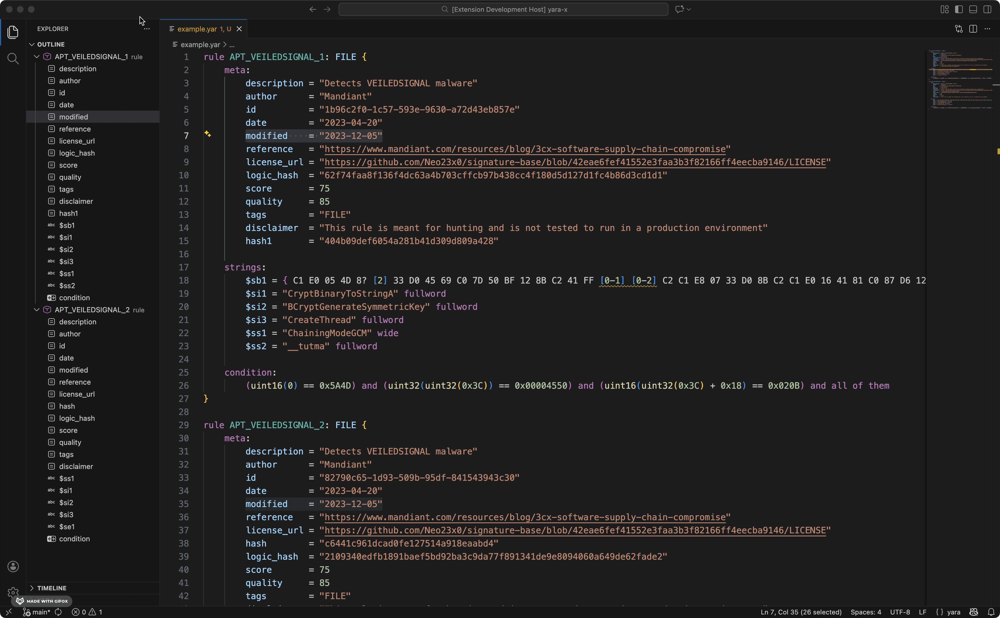

# YARA-X for Visual Studio Code

This extension brings support for the [YARA](https://virustotal.github.io/yara-x/)
language to Visual Studio Code, powered by the official YARA-X Language Server. It
provides a rich set of features to enhance your YARA rule development workflow.

## Features

*   **Syntax Highlighting**: Advanced, token-based syntax highlighting for YARA rules.
*   **Completions**: Autocompletion for modules, rule identifiers, and more.
*   **Diagnostics**: Real-time error checking and diagnostics to help you write valid rules.
*   **Hover Information**: Hover over any identifier to see its type, documentation, and other information.
*   **Go to Definition**: Navigate to the definition of a rule or pattern.
*   **Find References**: Find all references to a specific rule or identifier.
*   **Code Formatting**: Format your YARA rules according to the standard style.
*   **Rename**: Safely rename rule identifiers and variables across your files.
*   **Document outline**: See a symbol tree of your document for quick navigation.
*   **Code Actions**: Quick fixes and refactoring suggestions.

An image is worth a thousand words...

<p align="center">

<br/>
<em>(Demo)</em>
</p>

<p align="center">

<br/>
<em>(Navigation)</em>
</p>

<p align="center">

<br/>
<em>(Quick fix)</em>
</p>

## Quick Start

1.  Install the extension from the [Visual Studio Marketplace](https://marketplace.visualstudio.com/items?itemName=VirusTotal.yara-x-ls).
2.  Open a `.yara` or `.yar` file.
3.  The extension will automatically activate, and you can start using the features.

## Configuration

This extension respects the standard Visual Studio Code settings for formatting and other editor features. There are no YARA-X specific settings at this time.

The extension contributes the following default settings for the `[yara]` language:

```json
"[yara]": {
  "editor.tabSize": 4,
  "editor.insertSpaces": false,
  "editor.detectIndentation": false,
  "editor.formatOnSave": true
}
```

You can override these in your user or workspace settings.