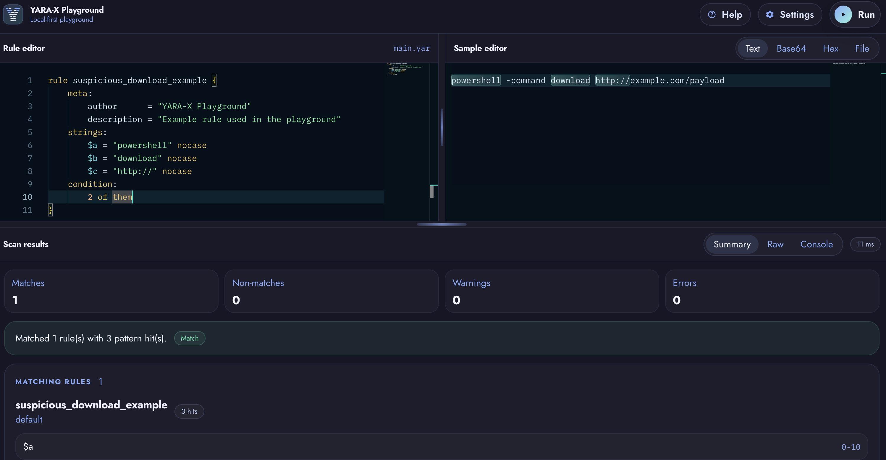
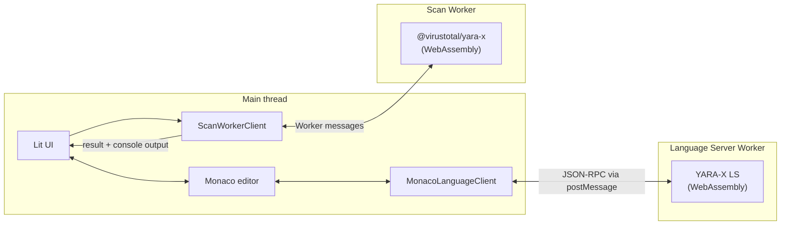

# YARA-X Playground

[](https://virustotal.github.io/yara-x/playground/)

Write, format and test YARA rules in the browser. Everything runs locally on WebAssembly. Nothing to install, nothing uploaded.

[](./docs/playground_screenshot.png)

## Features

- **Editor**: Monaco-based YARA editing with syntax highlighting and a minimap
- **Language Server**: runs in a Web Worker, providing
  - autocompletion
  - diagnostics
  - hover information
  - go-to-definition
  - formatting
- **Sample modes**: Text, Base64, Hex and local File
- **Match highlighting**: click a match range in Summary to focus it in Text and Hex modes, with rule, pattern, and byte-range details on hover
- **Persistence**: rule source, sample drafts, and settings saved to Local Storage across refreshes
- **Metadata validation**: formatting and validation rules aligned with the [YARA VS Code extension](https://marketplace.visualstudio.com/items?itemName=VirusTotal.yara-x-ls) configuration
- **Scanner limits**: configurable maximum matches per pattern for noisy samples
- **Results**: summary of matches, non-matches, warnings, and errors, plus raw JSON and `console` module output
- **Cancellable scans**: run in a dedicated Web Worker, cancellable from the toolbar
- **Powered by**: the official [`@virustotal/yara-x`](https://www.npmjs.com/package/@virustotal/yara-x) WebAssembly package, running entirely in the browser

### Shortcuts

| Shortcut           | Action                                  |
| ------------------ | --------------------------------------- |
| `Cmd/Ctrl + S`     | Format the current YARA rule            |
| `Cmd/Ctrl + Space` | Trigger autocompletion                  |
| `Cmd/Ctrl + Enter` | Run the rule against the current sample |

### Sample Modes

- **Text**: scan the text written in the editor.
- **Base64**: decode Base64 input before scanning.
- **Hex**: decode hexadecimal input before scanning.
- **File**: scan a selected local file.

To test YARA's `base64` string modifier, use **Text** mode.

### Settings

Settings configure rule formatting style, rule name and metadata validation, and the maximum matches per pattern.

Metadata rules cover required fields, expected types, date formats, and string patterns. For example, a rule can require `author` or `version` before sharing rules with a team. These options follow the applicable configuration from the [YARA VS Code extension](https://marketplace.visualstudio.com/items?itemName=VirusTotal.yara-x-ls).

More context: [enforcing YARA metadata standards](https://virustotal.github.io/yara-x/blog/enforcing-yara-metadata-standards/) and [the YARA-X Language Server](https://virustotal.github.io/yara-x/blog/introducing-the-yara-language-server/).

## How it works

The playground splits work between the main UI thread and two Web Workers: one for the Language Server and another for scanning.



The Language Server analyzes the rule as you type and sends diagnostics, completions, hover information, and navigation back to Monaco over JSON-RPC. The scanner builds the current rule and runs it against the sample, returning scan results and console output to the UI.

## Run locally

Node `24.16.0` is pinned in [`.nvmrc`](./.nvmrc).

```bash
nvm use
npm ci
npm run dev
```

Vite prints the local URL when it starts.

## Scope and Performance

The playground is designed for quickly testing one rule against one sample. For batch scans, automation, or very large files, use the [YARA-X CLI](https://virustotal.github.io/yara-x/docs/cli/commands/).

For noisy samples, **Max matches per pattern** in Settings can help keep result sets manageable.

## Privacy

Rules, inline sample drafts, and settings are stored in the browser's Local Storage, so a refresh does not lose work. This can fail silently in incognito mode or if the content is too large for Local Storage's size limit. Files selected in File mode are kept in memory for the current session only.

No rule, sample, or scan result is uploaded or shared.
