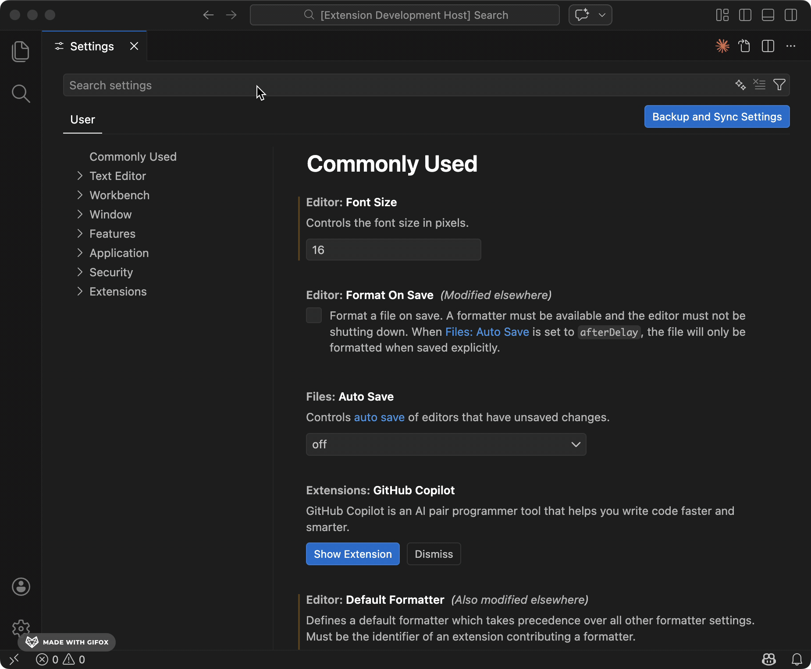

In team environments where multiple analysts contribute to a shared YARA rule corpus, maintaining consistency in rule
metadata is of utter importance. Many YARA rules across the industry already adhere to established metadata conventions,
yet often lack the appropriate tools for enforcing these conventions during rule creation. Ensuring that every rule
includes essential metadata—such as author, version, or description—and that this metadata adheres to predefined types,
is crucial for rule management, automation, and overall maintainability.

This is where the YARA Language Server, offers a powerful solution: metadata validation.


### The Language Server to the rescue

The YARA Language Server introduces a metadataValidation configuration that allows teams to define and enforce strict
metadata standards directly within the editor. This feature transforms metadata consistency from a manual review 
process into an automated, real-time feedback loop for rule developers.

The `metadataValidation` setting is configured in your Visual Studio Code `settings.json` file. It’s an array of objects,
where each object specifies validation rules for a particular metadata field.

Here’s an example configuration:

```JSON
"YARA.metadataValidation": [
  {
    "identifier": "author",
    "required": true,
    "type": "string"
  },
  {
    "identifier": "version",
    "required": true,
    "type": "integer"
  },
  {
    "identifier": "last_reviewed",
    "required": false,
    "type": "string"
  },
  {
    "identifier": "status",
    "required": true,
    "type": "string"
  },
  {
    "identifier": "confidence",
    "required": false,
    "type": "float"
  }
]
```
You can easily configure these settings in Visual Studio Code. Access the settings by navigating to 
**Code > Settings > Settings** and searching for “yara”. This will bring up the configuration options where you can
define your metadata validation rules.


    
Let’s break down the properties for each validation object. The `identifier` property is a required string that sets 
the name of the metadata field you want to validate (e.g., `author`, `version`). The required property is an optional 
boolean that, if set to `true`, will cause the language server to issue a warning if the metadata field is missing from
a rule. It defaults to `false`. Finally, the `type` property is an optional string that specifies the expected data 
type for the metadata value. Valid options are `"string"`, `"integer"`, `"float"`, and `"bool"`. If the value in the 
YARA rule does not match the specified type, a warning will be generated.

With this configuration in place, the Language Server provides immediate feedback in the Visual Studio Code editor 
as soon as a YARA rule is written or modified. For example, if an `author` or `version` field (marked as `required: true`) 
is omitted, a warning for missing required fields will appear. If `version` is provided as a string instead of an 
integer, a type mismatch warning will be shown. This real-time feedback allows developers to see issues as they type, 
empowering them to correct problems instantly before committing their code.

### Benefits for teams and organizations

Implementing metadata validation brings significant advantages. It enhances rule quality by ensuring all rules adhere
to a common standard of completeness and correctness. It also improves collaboration by providing a clear, automated
guide for all team members on what metadata is expected, which reduces ambiguity and fosters consistent contributions.

Furthermore, this feature simplifies automation, as consistent metadata enables more reliable parsing and automation
of rule management tasks, such as generating reports or categorizing rules. It also accelerates the onboarding of new
analysts, who can quickly understand the required metadata format without extensive manual guidance. By catching 
metadata issues at the development stage, the risk of deploying malformed or incomplete rules is significantly 
lowered, thereby reducing errors.

Embrace consistent metadata and elevate your YARA rule management today!