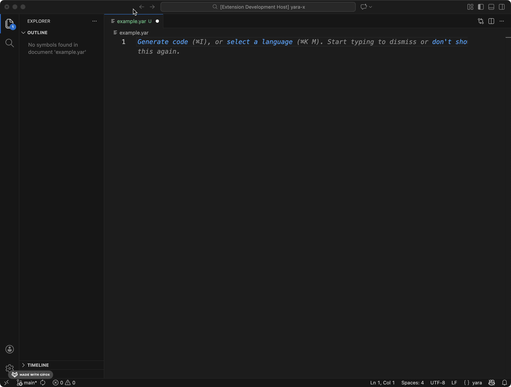

From the very beginning of the YARA-X project, our goal was not only to modernize the YARA engine itself but also to 
revolutionize the entire experience of writing YARA rules. We knew that performance and expressiveness were critical, 
but we also recognized that the day-to-day workflow of security researchers and developers needed a significant 
upgrade. Today, we are thrilled to announce a major step towards that vision: the official YARA-X Language Server.

### What is a Language Server?

For those unfamiliar with the term, a Language Server is a dedicated background process that acts as a "brain" for 
a specific language. Your favorite code editor (like VS Code, Sublime Text, or Vim) communicates with this server 
to provide intelligent, context-aware features. This approach, based on the Language Server Protocol (LSP), means 
that we can build a single, powerful engine for YARA-X and have it work across a wide range of editors without 
having to write a new extension from scratch for each one.

### A Smarter Way to Write YARA Rules

So, what does the YARA-X Language Server mean for you? Here are some of the key features available today:

*   **Real-time Diagnostics:** Say goodbye to the slow feedback loop of writing a rule, saving it, and running 
    it through a compiler only to find a simple syntax error. The language server analyzes your code as you type, 
    highlighting mistakes and providing descriptive errors on the fly.

*   **Advanced Autocompletion:** The server provides intelligent suggestions for module identifiers 
    (e.g., `pe.`, `cuckoo.`), keywords, and more. This not only speeds up your writing but also helps you discover  
    the rich features available in YARA-X without constantly referencing documentation.

*   **Go to Definition:** Working with large, complex rule sets that span multiple files? You can now instantly jump 
    to the definition of a rule or pattern, making it easier to navigate and understand your rules.

*   **Automatic Formatting:** Keep your YARA rules consistent and clean with automatic code formatting. The language  
    server can automatically format your code according to best practices, saving you time and ensuring readability.

    
### Get Started Today

The YARA-X Language Server is now available for Visual Studio Code. It's currently in beta, but you can install
it from the [Visual Studio Marketplace](https://marketplace.visualstudio.com/items?itemName=virustotal.yara-x-ls) and
start using it already.

This is just the beginning. We plan to continue enhancing the language server with more powerful features, and we
encourage the community to integrate it with other editors.

We are incredibly excited to get this into your hands. Try it out, and let us know what you think by opening an
issue on our [GitHub repository](https://github.com/VirusTotal/yara-x). Happy hunting!
