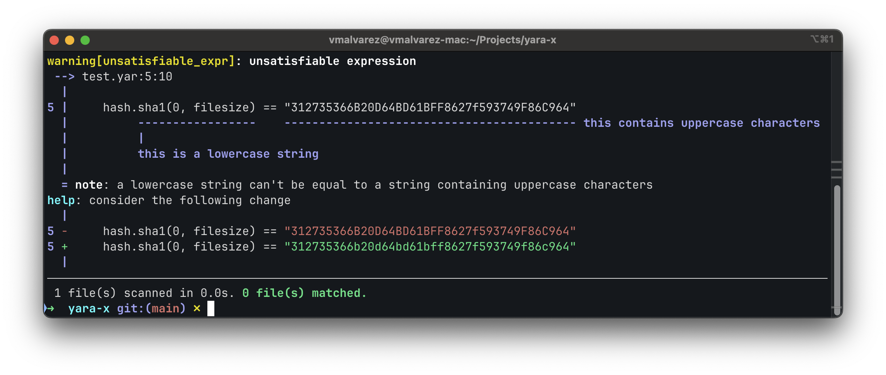
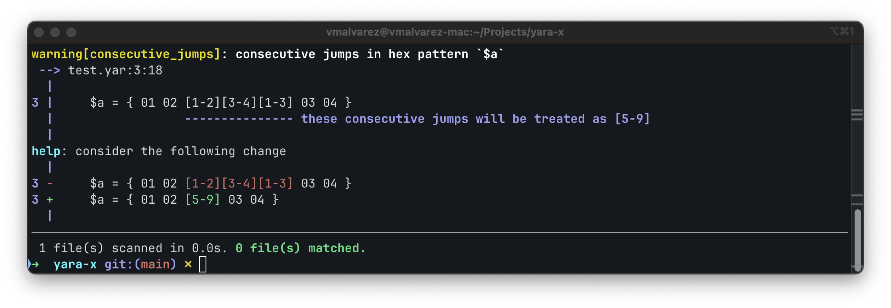

From day one, my mission with YARA-X has been simple: to build a more usable
and user-friendly tool. That effort has paid off, primarily through clearer error
reporting and more informative warnings. YARA-X doesn't just tell you something 
is wrong; it helps you prevent common mistakes and guide you toward writing more
efficient rules.

Take this frequent pitfall: comparing a hash function result with an uppercase 
string. When you copy-paste a hash, it's easy to forget that all functions in the
hash module are strictly lowercase. YARA-X is smart enough to spot this issue 
instantly:



In other cases, the warnings are less critical but still important for performance.
For instance, a hex pattern containing consecutive jumps will trigger a notification:



These are just a few examples of the valuable warnings that helps you keep your 
rules tidy. And yes, for those cases were you want to ignore a warning, YARA-X 1.4.0
introduced a [warning suppression comments](../../docs/writing_rules/disabling-warnings).

But I asked myself... what's even better than a smart warning that can be suppressed
if needed?

*A warning that YARA-X fixes for you!*

# The "fix warnings" command

YARA-X 1.10.0 introduces a new command that automatically fixes many warnings for you.
Let's see some examples:

```shell
$ yr fix warnings my_rules.yar
```

The command above fixes any automatically-fixable warnings in the file `my_rules.yar`. If you
want to do the same for multiple files in a directory you simply pass the directory:

```shell
$ yr fix warnings my_rules_dir
```

As this command tries to compile the rules, it receives the same arguments as the `yr compile`
command. The difference between the two is that `yr fix warning` modifies the source files
for fixing any warning that can be fixed, and doesn't produce a file with the compiled rules.

Of course, not all warnings can be fixed automatically. Automatically fixable warnings are those
for which YARA-X already proposes a fix in the warning message. The new command simply applies
the proposed fixes in an automated way.

Bonus track: The `yr fix warnings` command is accompanied by its cousin the `yr fix encoding` command, but
we are going to talk about this command in a future article.

