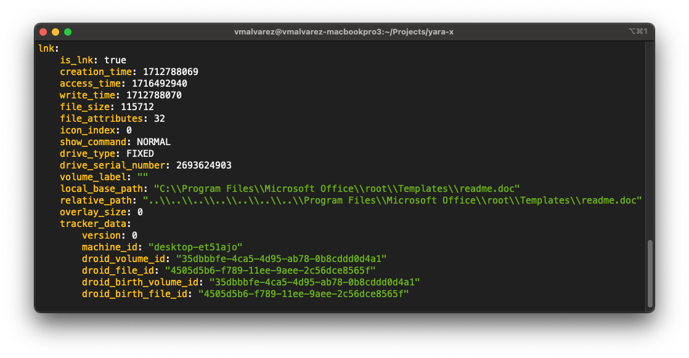

As you may already know, YARA-X has modules that can parse certain file formats
and produce a data structure containing information extracted from the parsed
files. This information can be leveraged to create more precise and powerful
rules tailored to each file format's unique characteristics.

YARA-X supports the parsing of several file formats, including:

* [PE](https://en.wikipedia.org/wiki/Portable_Executable) (Portable Executable)
* [.NET](https://en.wikipedia.org/wiki/.NET_Framework) (PE file for the .NET
  framework)
* [ELF](https://en.wikipedia.org/wiki/Executable_and_Linkable_Format) (
  Executable and Linkable Format)
* [Mach-O](https://en.wikipedia.org/wiki/Mach-O) (Mach Object file format)
* [LNK](https://learn.microsoft.com/en-us/openspecs/windows_protocols/ms-shllink/16cb4ca1-9339-4d0c-a68d-bf1d6cc0f943) (
  Windows Shortcut)

For each of these formats, YARA-X constructs a comprehensive data structure
that describes the file in detail.

While the legacy YARA also had the capability to parse these file formats,
YARA-X brings a significant improvement by making the inspection of these data
structures much more straightforward. This is accomplished through the dump
command:

```
yr dump [FILE]
```

By executing this command, YARA-X parses the specified file using all the
relevant modules and outputs the generated data structures. The output is
provided in YAML format by default, chosen for its readability and ease of use
by both humans and machines. But JSON format is also available.

Previously, YARA offered the `--print-module-data` option (or `-D`), which
provided similar functionality. However, it required users to pass a YARA source
file that imported the desired modules, and the output was often cumbersome and
difficult to interpret. This option was primarily intended as a debugging tool
but gained unexpected popularity among users for extracting information about
certain file formats.

With the introduction of the `dump` command in YARA-X, this process is greatly
simplified, providing users with a more efficient and user-friendly way to
access detailed information about various file formats. See how the output
of this command looks like:



If you want to learn more about the `dump` command, see its [documentation](#dump)

