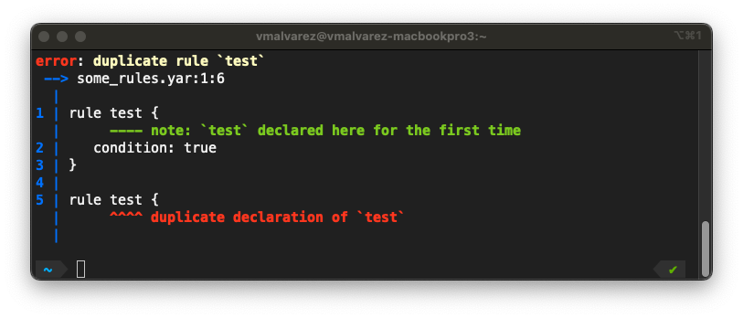
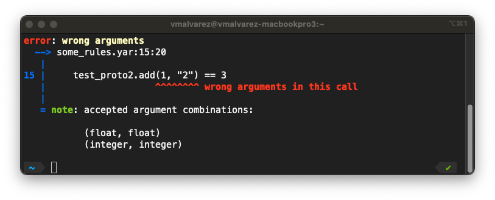

YARA-X intends to be the replacement for YARA, and it has been designed with
usability, backward-compatibility, and performance in mind. YARA-X is already
better than YARA in many aspects, but it's still very young and therefore some
features are not implemented yet, and there are rough edges that need to be
polished. This section covers the pros and cons of YARA-X versus YARA.

## The good things

Let's start by talking about the things that YARA-X does better. If you prefer
seeing the glass half-empty go to [the bad things](#the-bad-things) section.

### Better error reporting

Error reports in YARA-X are much more detailed and explicative. Each error
message tries to provide as much context about the error as possible, which
improves the user's experience. They also look better, as you can see below.





### More powerful CLI

YARA-X's command-line interface (CLI) provides several advantages compared to
its YARA counterpart:

* Colorful output, enhancing readability if the terminal supports it.
* More information about the files being scanned.
* Autocompletion support for multiple shells, including Bash, Zsh, and
  PowerShell, improving usability and efficiency during command entry.
* Access to the output of YARA modules in YAML and JSON formats without
  requiring any YARA rule. This capability transforms YARA-X into a versatile
  file dissection tool supporting multiple file formats, like
  [PE](https://en.wikipedia.org/wiki/Portable_Executable), [ELF](https://en.wikipedia.org/wiki/Executable_and_Linkable_Format),
  [Mach-O](https://en.wikipedia.org/wiki/Mach-O)
  and LNK (Windows link file).

### Higher overall performance

YARA-X's is better than YARA when dealing with regular expressions and complex
hex patterns. Let's use the following rule for detecting Bitcoin addresses as
an example:

```yara
rule bitcoin_address {
  strings:
    $btc = /(bc1|[13])[a-zA-HJ-NP-Z0-9]{25,39}/ fullword
  condition:
    $btc
}
```

The rule above is very slow in YARA. In fact, YARA complains about this rule
with a warning like:

```
warning: rule "bitcoin_address" in bitcoin.yar(3): string "$btc" may slow down scanning
```

If you scan a relatively large file (let's say ~200MB), this rule will take more
than 20 seconds in YARA, but less than a second in YARA-X.

Similarly, rules with extensive loops, like the following example, perform
significantly faster in YARA-X compared to YARA. This rule will be 5-6x faster
in YARA-X than in YARA:

```
rule cafebabe {
  condition:
    for any i in (0..filesize-1) : (
      uint32(i) == 0xCAFEBABE
    )
}
```

Notably, not all rules benefit from YARA-X's optimizations. Rules that are
already optimized for performance, and only use plain text patterns or simple
hex patterns, are likely to run faster in YARA. This is because YARA is still
around 2-3x times faster than YARA-X at raw scanning speed (i.e. the inner loop
of the Aho-Corasick algorithm is faster in YARA). However, when encountering a
mixture of heterogeneous rules, the worst rules are the ones that dominate the
scanning time, often slowing down the process by a factor of 10x or more. As
YARA-X is much better at handling those slow cases, the overall performance is
usually better.

There's room for improvement here, and the goal is making YARA-X faster than
YARA in all cases.

### Parser re-usability

One of the problems with YARA was its monolithic design. The parser was so
integrated with the rule compilation logic that it was impossible to reuse
it for other purposes, like code formatting tools, linters, etc.

Consequently, numerous alternative YARA parsers have emerged over time, such as
[[1]](https://github.com/VirusTotal/gyp), [[2]](https://github.com/Northern-Lights/yara-parser), [[3]](https://plyara.readthedocs.io/en/latest/)).
But maintaining those parser in-sync with the official one is hard, and very
often they lag behind.

YARA-X, in contrast, has a more modular design, where the parser is decoupled
from the rule compilation logic, allowing the reuse of the parser for other
purposes.

## The bad things

Of course, not everything is great. YARA-X has some drawbacks that we need to
discuss too. Some of the drawbacks are related to the lack of features that
YARA already has, but YARA-X does not. These may be eliminated in the future as
YARA-X matures.

### Incompatible APIs

The YARA-X C/C++, Python, and Golang APIs are not compatible with their YARA
counterparts. YARA-X is not a drop-in replacement for YARA, you will need to
adapt your own programs to the new API.

However, the APIs are conceptually similar, and the migration process should
be very simple in most cases.

### No include statements

The `include` statement supported by YARA is not implemented in YARA-X yet.
This is a temporary situation, though. We plan to support this feature in later
versions of YARA-X.

Many YARA users employ the `include` statement as a way to join together
multiple source files. In such cases, they have a main file (let's say
`index.yar`) that simply includes every other file they want to compile. This
was required because you can't pass to YARA a directory containing multiple
source files so that YARA uses all of them. In YARA-X this is possible, you
can pass a directory with multiple source files. For instance:

```bash
yr scan my_yara_repository file_to_scan
```

With the command above YARA-X will use every `*.yar` or `*.yara` file contained
in `my_yara_repository` (the search is recursive, so it will look into
subdirectories as well). If all you want is using every file source file in
a directory, you don't need to use or maintain a `index.yar` file that contains
`include` statements for every file in that directory.

### No process scanning

Process scanning is not implemented in YARA-X yet. This may change in the future
if this feature has enough demand. For the time being it's a low priority
feature, but let us know if you really want process scanning implemented.
